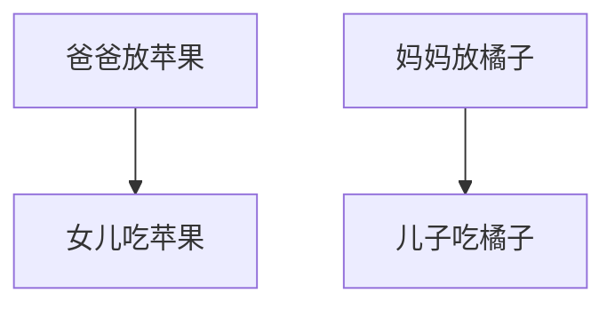

### question
桌子上有一个盘子，每次只能向其中放入一个水果。爸爸专门向盘子中放苹果，妈妈专门向盘子中放橘子，儿子专等吃盘子中的橘子，女儿专等吃盘子中的苹果。只有盘子为空时，爸爸妈妈才可向盘子中放一个水果；仅当盘子中有自己需要的水果时，儿子或女儿可以从盘子中取出。

### analysis
* 复杂生产者-消费者问题
* 爸爸和妈妈之间对盘子的访问是互斥（exclusion）关系；
* 爸爸和女儿，妈妈和儿子，二者是同步（synchronization）关系；

### graph


### semaphore
```
semaphore plate = 1;  //临界区互斥信号量
semaphore orange = 0; //盘子中橘子个数
semaphore apple = 0;  //盘子中苹果个数
```

### dad and mom process
```
dad(){
    while(1){
        perpare an apple for daugher; //准备苹果
        P(plate);                     //进入临界区（访问盘子）
        put an apple on the plate;    //放置苹果
        V(apple);                     //苹果个数+1
    }
}

mom(){
    while(1){
        perpare an orange for son;    //准备橘子
        P(plate);                     //进入临界区（访问盘子）
        put an orange on the plate;   //放置橘子
        V(orange);                    //橘子个数+1
    }
}
```

### daughter and son process
```
daughter(){
    while(1){
        P(apple);                     //互斥向盘中取苹果
        take an apple;                
        V(plate);                     //释放临界资源
        eat the apple;
    }
}

son(){
    while(1){
        P(orange);                    //互斥向盘中取橘子
        take an orange;               
        V(plate);                     //释放临界资源
        eat an orange;                
    }
}
```