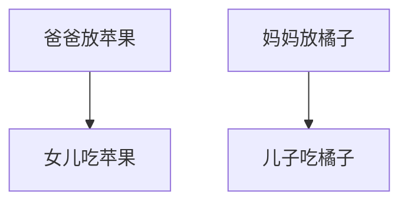

### question
桌子上有一个盘子，每次只能向其中放入一个水果。爸爸专门向盘子中放苹果，妈妈专门向盘子中放橘子，儿子专等吃盘子中的橘子，女儿专等吃盘子中的苹果。只有盘子为空时，爸爸妈妈才可向盘子中放一个水果；仅当盘子中有自己需要的水果时，儿子或女儿可以从盘子中取出。

### analysis
* 复杂生产者-消费者问题
* 爸爸和妈妈之间对盘子的访问是互斥（exclusion）关系；
* 生产者生产之后，消费者才能消费，二者是同步（synchronization）关系；

### graph


### code
```
semaphore mutex = 1;  //临界区互斥信号量
semaphore empty = n;  //空闲缓冲区个数
semaphore full = 0;   //缓冲区初始化
```

#### producer process

```
producer(){
    while(1){
        produce an item in nextp; //生产数据
        P(empty);                 //空buffer个数-1
        P(mutex);                 //互斥夹紧
        add a nextp to buffer;
        V(mutex);                 //互斥加紧
        V(full);                  //满buffer个数+1
    }
}
```

#### consumer process

```
consumer(){
    while(1){
        P(full);                     //满buffer个数-1
        P(mutex);                    //互斥夹紧
        remove an item from buffer;  //从缓冲区中取的数据
        V(mutex);                    //互斥夹紧
        V(empty);                    //空buffer个数+1
        consume the item;            //消费数据
    }
}