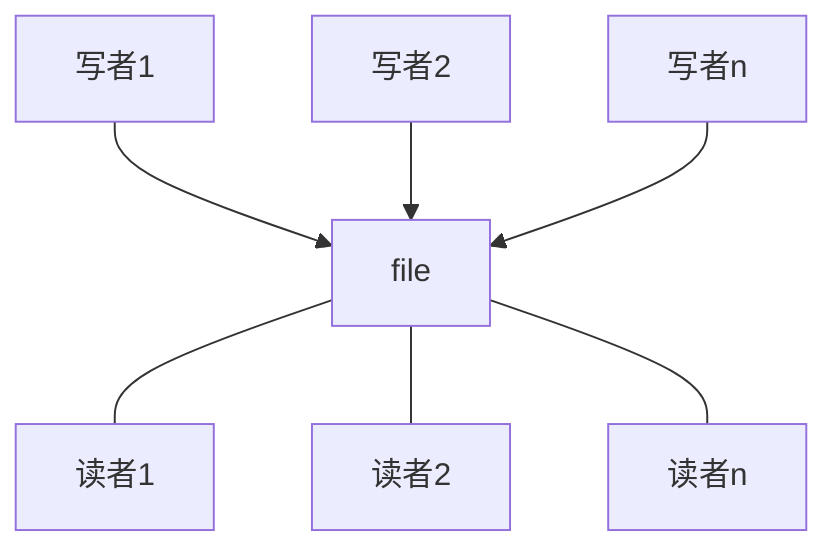

### question
有读者和写者两组并发进程，共享一个文件，当两个或以上的读进程同时访问共享数据时，不会产生副作用，但若某个写进程和其他进程（读进程或写进程）同时访问共享数据时，则可能导致数据不一样的错误；因此要求：
1. 允许多个读者可以同时对文件执行读操作；
2. 只允许一个写者往文件中写信息；
3. 任一写者在完成写操作之前不允许其他读者或者写者工作；
4. 写者执行写操作前，应让已有的读者和写者全部退出；

### analysis
* 读者-写者问题
* 写者和读者、写者和写者对文件的访问是互斥（exclusion）关系；

### graph


### reader first
#### semaphore
```
int count = 0;        //进程计数
semaphore mutex = 1;  //保证count互斥信号量
semaphore file = 1;   //读者和写者互斥信号量
```
#### writer process
```
writer(){
    while(1){
        P(file);      //互斥访问文件
        writing;      //写入文件
        V(file);      //释放访问文件
    }
}
```
#### reader process
```
reader(){
    while(1){
        P(mutex);      //保证count计数的互斥
        if(count == 0) //如果是第一个读进程 
            P(file);   //读写互斥
        count++;       //写进程个数+1
        V(mutex);      //释放count
        reading;       //读取
        P(mutex);      //保证count计数的互斥
        count--;       //读进程个数-1
        if(count == 0) //如果没有读进程
            V(file);   //允许写进程写
        V(mutex);      //释放count
    }
}
```
### writer first
#### semaphore
**增加一对PV操作来保证写优先**
```
int count = 0;        //进程计数
semaphore mutex = 1;  //保证count互斥信号量
semaphore file = 1;   //读者和写者互斥信号量
semaphore w = 1;      //用于保证“写进程优先”
```
#### writer process
```
writer(){
    while(1){
        P(w);         //防止读进程进入
        P(file);      //互斥访问文件
        writing;      //写入文件
        V(file);      //释放访问文件
        V(w);         //允许读进程进入
    }
}
```
#### reader process
```
reader(){
    while(1){
        P(w);          //当有写进程时候，保证写优先
        P(mutex);      //保证count计数的互斥
        if(count == 0) //如果是第一个读进程 
            P(file);   //读写互斥
        count++;       //写进程个数+1
        V(mutex);      //释放count
        reading;       //读取
        P(mutex);      //保证count计数的互斥
        count--;       //读进程个数-1
        if(count == 0) //如果没有读进程
            V(file);   //允许写进程写
        V(mutex);      //释放count
    }
}
```
